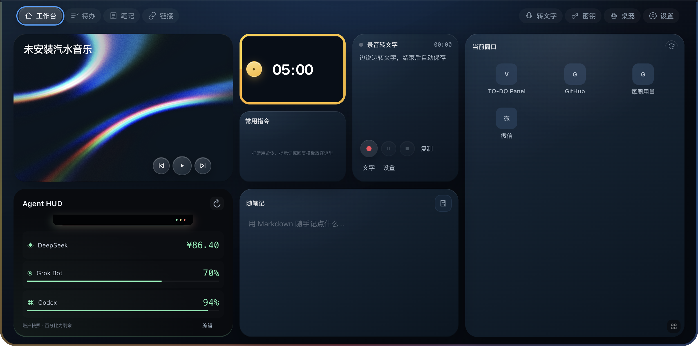
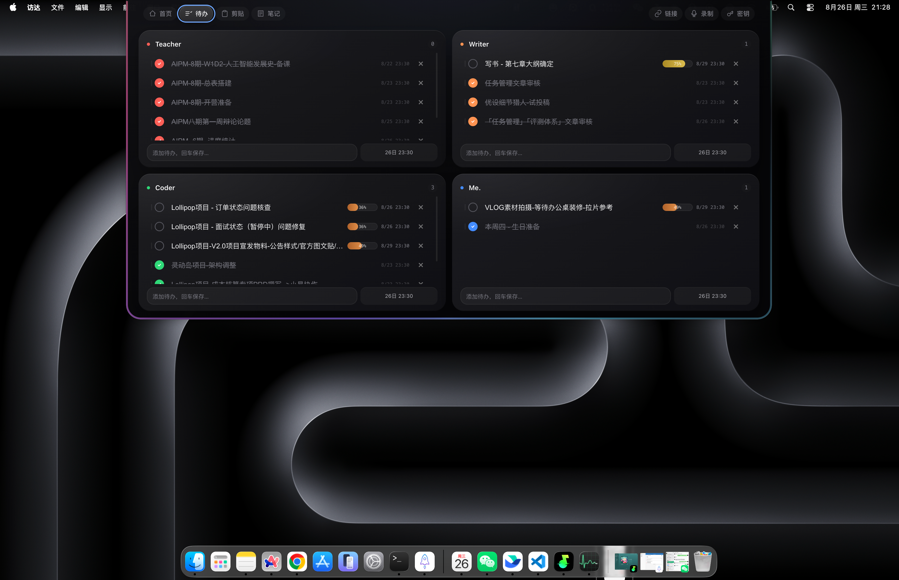

<div align="center">


# TO-DO Panel

**常驻 macOS / Windows 屏幕顶部的本地工作台。**

待办、随笔记、链接、录音与本机 AI 提醒，始终贴顶待命。

<p>
  <a href="#从源码运行"><strong>从源码运行</strong></a>
  ·
  <a href="#功能特性">功能特性</a>
  ·
  <a href="#技术栈">技术栈</a>
  ·
  <a href="#项目结构">项目结构</a>
  ·
  <a href="#更新日志">更新日志</a>
</p>

<p>
  
  
  
  
</p>

</div>





## 它是什么

TO-DO Panel 是一个常驻 macOS / Windows 屏幕顶部的本地工作台。Mac 默认折叠成物理刘海大小；Windows 显示为贴顶的 200 × 38 逻辑像素悬浮条，避开顶部任务栏。点击后从顶部展开，包含首页、待办、笔记、链接、录制、密钥等页面。

数据全部保存在本机（LocalStorage 与工作区文件），无后端、无云同步。

## 下载

> 当前稳定版本：**1.1.2** · macOS 13.0+ Apple Silicon / Windows 10/11 x64

| 平台 | 下载 |
| --- | --- |
| macOS | [GitHub Releases 最新版（arm64.dmg）](https://github.com/yuexiangxu/TO-DO-Panel/releases/latest) |
| Windows | [GitHub Releases 最新版（x64-setup.exe）](https://github.com/yuexiangxu/TO-DO-Panel/releases/latest) |

推送与 `package.json` 版本一致的 `v*.*.*` 标签后，GitHub Actions 会构建并发布对应平台的安装包。

## ✨ 功能特性

| 页面 | 说明 |
| --- | --- |
| **工作台** | 当前窗口、Agent HUD、录音转文字、随笔记、常用指令、汽水音乐与番茄钟集中在一个可拖拽的 Bento 工作台 |
| **待办** | 四个可改名的分类（默认 课程 / 自媒体&写作 / Vibe coding / 日常），回车即新增，默认当天 23:30，到期前一小时提醒 |
| **笔记** | Markdown 速记、归档、搜索、重命名与智能标题 |
| **链接** | 保存公开网址，后台补全标题、图标和分组（阻止本机、内网与不安全重定向） |
| **转文字** | 百炼实时语音转写，录音前检查配置，全文可编辑、复制，原始音频同时保存在本机 |
| **密钥** | 账号密码与 API Key 经系统安全存储加密 |
| **剪贴板** | 默认关闭，可启用；历史由主进程轮询采集，图片不落 LocalStorage |
| **AI 提醒** | 接收 Codex / Claude Code / GPT 的本机完成事件，显示为不抢焦点的顶部提醒 |
| **桌宠** | 顶栏一键召唤蓝白小兽到桌面右下角；独立透明悬浮、可拖动并记住位置，也可从桌宠或顶栏收回 |

隐私边界：工作台镜子已替换为 Agent HUD，不再包含摄像头入口；录音结束释放麦克风；链接抓取只允许公开 http/https。

## Agent HUD（本地开发版）

Agent HUD 已嵌入工作台并替换镜子卡片；仅保留工作台卡片，不再提供独立页面或顶部导航。新配置默认进入工作台；已保存的默认页偏好不变。原首页保留为「工作台」，待办、笔记等数据结构不变。设置中的「默认展开页」可随时切换。旧的 Agent HUD 默认页设置自动回退到工作台。点击与键盘唤出仍可使用。

- 工作台卡片沿用镜子原先的位置、尺寸和显隐偏好，可长按空白区域拖拽、切换尺寸；卡片内可刷新、编辑快照或打开对应账户。镜子与封面设置入口已移除。
- 额度明确区分「账户快照」「手动快照」「API 实时查询」，未知值显示待连接。百分比展示剩余量，并同时标注已用量。
- 「编辑快照」仅把非敏感额度数值写入本机工作区；留空代表未知。未修改的账户保持原来源和采集时间。「恢复来源」删除手动覆盖，再读取账户来源。
- 「刷新」查询 Codex 登录账户的本周额度，以及已配置 Key 的 DeepSeek 实时余额；macOS 同步 Grok Bot 自己写入的最新用量缓存（不是强制联网查询）。卡片显示实时成功项数，悬停每一行可查看来源、状态与采集时间。重复点击合并为同一次查询，失败保留旧数据及原始时间。
- Codex 使用官方 `account/rateLimits/read`，按窗口长度选择周额度；自动检测此 Mac 的内置 CLI，也支持 `CODEX_CLI_PATH` 或 PATH 中的 `codex`。读取的是该 CLI 已登录的账户。Grok Bot 需先打开每周用量，多个账户缓存时提示用户确认，不猜测账户。
- 成功获取的数据保存在 Electron userData 的 `agent-usage.json`；`.local` 仅作为初次启动的兼容数据。实时结果替换手动覆盖；Grok 缓存只有比手动快照更新时才替换。

本地账户快照文件为 `.local/agent-usage.json`（已加入 Git 忽略，不包含在安装包中），格式：

```json
{
  "deepseek": { "value": 12.34, "updatedAt": "2026-10-06T00:00:00Z" },
  "codex": { "value": 24, "updatedAt": "2026-10-06T00:00:00Z", "resetsAt": "2026-10-10T00:00:00Z" },
  "grok": { "value": null }
}
```

以上为格式示例。DeepSeek 的 `value` 为人民币余额；Codex / Grok 为每周**已用**百分比（0–100），必须附上真实采集时间。此处 Grok 指本机 Grok Bot，其账户菜单 →「每周用量」可查看已用百分比和重置提示；面板入口在 macOS 上打开本机应用，不再跳转 Grok 网页版。

DeepSeek 自动查询使用官方 [GET /user/balance](https://api-docs.deepseek.com/api/get-user-balance)，只读取 CNY 余额。应用会优先读取环境变量 `DEEPSEEK_API_KEY`，否则复用“转文字”设置中通过系统安全存储加密保存的 DeepSeek API Key；密钥不进入渲染层、LocalStorage 或快照文件。请求设有 10 秒超时，失败时保留本机快照并显示错误。网页平台登录态不会自动授予 Electron API 访问权限。

## 🧱 技术栈

| 层 | 技术 |
| --- | --- |
| 🖥️ 桌面端 | Electron 44 · 原生 HTML / CSS / JavaScript（无渲染层构建步骤） |
| 🌐 官网 | React 19 · Vinext · 原生 CSS（`website/`） |
| 💾 数据 | LocalStorage + `userData/`（录音、剪贴板图片），无后端与云同步 |
| 📦 打包 | electron-builder（macOS DMG / Windows NSIS EXE） |

## 📁 项目结构

```text
.
├── main.js                 # Electron 主进程：窗口、定位、菜单栏、剪贴板、媒体与通知
├── main-services.js        # 可单测的纯领域服务（无 Electron 依赖）
├── preload.js              # contextBridge 安全桥接
├── renderer/               # 桌面界面与交互（HTML / CSS / JS）
├── build/                  # 打包钩子、entitlements 与应用图标
├── scripts/                # Codex / Claude Code 的通知转发脚本
├── tests/                  # Node 单元测试与渲染层检查
├── docs/                   # 设计说明、ADR 与验收图
└── website/                # 官网 React/Vinext 源码
```

## 🚀 从源码运行

桌面端要求 Node.js 18+：

```bash
git clone https://github.com/yuexiangxu/TO-DO-Panel.git
cd TO-DO-Panel
npm install
npm start
```

项目使用单一 Electron 架构，`npm start` 是唯一运行路径。

| 命令 | 用途 |
| --- | --- |
| `npm test` | 单元测试与 JavaScript 语法检查 |
| `npm start` | 启动 Electron 开发版 |
| `npm run pack` | 生成未安装的 `.app` |
| `npm run build` | 生成 Apple Silicon DMG（需用户确认） |
| `npm run build:win` | 生成 Windows x64 EXE 安装包 |
| `npm run build:zip` | 生成 ZIP 分发包 |

官网（`website/`）要求 Node.js 22.13.0+：

```bash
cd website
npm install
npm run dev
```

## 更新日志

当前稳定版本：**1.1.2**。完整版本历史、修复内容与未发布改动见 [CHANGELOG.md](CHANGELOG.md)。

## License

[MIT](LICENSE) © 2026 [yuexiangxu](https://github.com/yuexiangxu)

### 录音转文字

工作台点击开始按钮，使用百炼实时语音识别边录边转写。首次使用会先打开配置，需填写百炼 API Key；保存后再次点击开始，不会自动开启麦克风。配置读取失败或密钥失效时不会退回纯录音。语音发送至所选百炼区域处理，DeepSeek 只负责可选的智能命名，不是转写的必填配置。

工作台“复制”直接复制本次已确认的识别文字，未录音时复制最新一条录音的文字，并提示成功或失败；“文字”打开完整转写页；支持暂停、继续、结束，结束后文字可编辑、复制，原始音频可回放。转写连接中断会明确提示并尝试重连，已识别的文字和录音继续保留；断线可能缺失的文字不会标记为完整。已有纯音频记录不会自动补转写。
